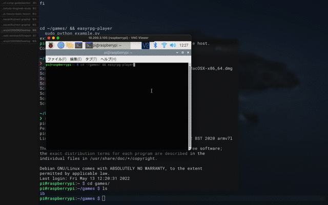
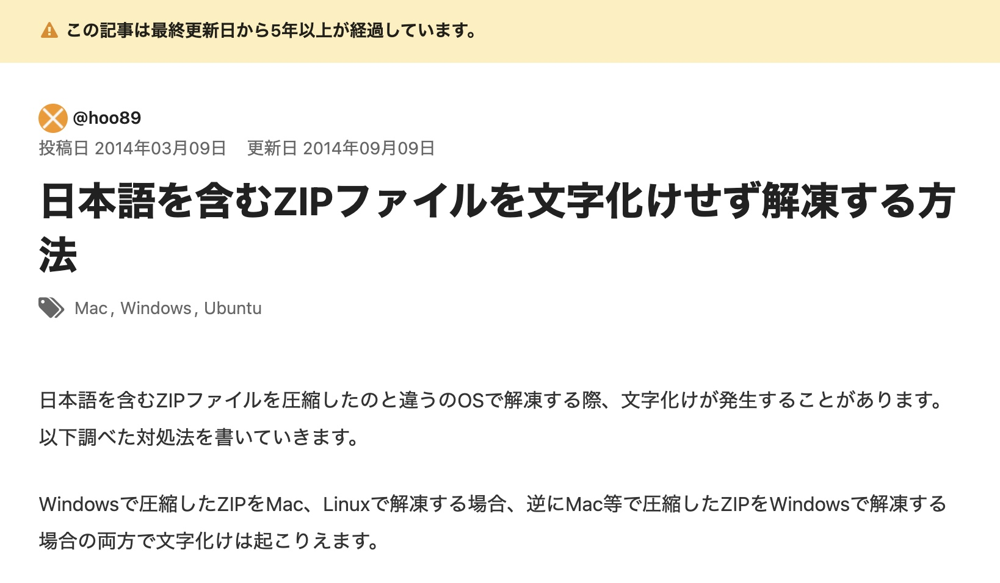

# 外出先でも rpg ツクール製のゲームを遊べるようにした

## WD3A 岡崎 流依

---

## 目次

1. 作成に至った背景
2. 完成した物
3. 用意するもの
4. 解説

---

# 作成に至った背景

---

<!-- _header: 作成に至った背景 -->

### 出先で rpg ツクール製のゲームを遊びたい。。。！

---

# 完成した物

---



---

# 用意するもの

- raspberry pi
- 3.5 インチの小型モニター
- コントローラーになりうるもの
- モバイルバッテリー

---

# 解説

---

今回は easyrpg というライブラリを使用して作成していきます。
https://easyrpg.org/

---

ラズパイのバージョン確認

```
$ lsb_release -a
```

私の環境は v10 なので easyrpg の 10 系をインストールする

```
$ echo 'deb http://download.opensuse.org/repositories/home:/easyrpg/Raspbian_10/ /' | sudo tee /etc/apt/sources.list.d/home:easyrpg.list
$ curl -fsSL https://download.opensuse.org/repositories/home:easyrpg/Raspbian_10/Release.key | gpg --dearmor | sudo tee /etc/apt/trusted.gpg.d/home_easyrpg.gpg > /dev/null
$ sudo apt update
$ sudo apt install easyrpg-player
```

SSH または VNC 接続できるようにしておくと作業がしやすいかも。。。

---

rpg ツクール製のゲームを動かすのには RTP(Run Time Package) が必要みたい<br />
でも RTP のインストーラーは windows でしか動かないので、windows でインストーラーを実行し、ファイルを linux に転送する方法を取ることにしました<br /><br />

インストーラー ↓
https://tkool.jp/products/rtp.html

---

適当な場所に RTP のファイルを移動させたら次は、EasyRPG Player で読み込むために、パスを通します。

```
$ echo $SHELL
```

で現在のシェルを確認すると bash を使用していたので`.bash_profile`に書き込んでいきます！

```
$ vi ~/.bash_profile
export RPG2K_RTP_PATH=/home/ユーザー名/**/2000/RTP
export RPG2K3_RTP_PATH=/home/ユーザー名/**/2003/RTP
```

---

今回は試しに ib を動かしていきたいと思います。
なのでとりあえず DL する ↓
http://www.vector.co.jp/soft/win95/game/se495899.html

zip ファイルを解凍して、今回使用するファイル群が `ib/data/` ディレクトリに格納されいるのでファイル群をわかりやすい場所に移動させる。
そして移動先の親ディレクトリにてコマンドを実行して立ち上げる！

```
$ easyrpg-player
```

---

# 完成〜！！🥳🥳🥳

と思いきや...

---

# 文字化けしていて内容がわからんばい。。。

---

### zip ファイルは Shift-JIS などでエンコードされていることがあり、<br/>ラズパイの解凍機能だと正しく解凍されないらしい

---

良さそうな記事を見つけたので参考にしてみる


---

## unar というのを使うのが良さそうなので入れてみる

```
$ sudo apt install unar
```

解凍する

```
$ unar ib.zip
```

公式 ↓
https://theunarchiver.com/command-line

---

# もう一度同じ手順を繰り返して…起動！！

---

# 文字化けなく動いた〜！！🥳🥳🥳
