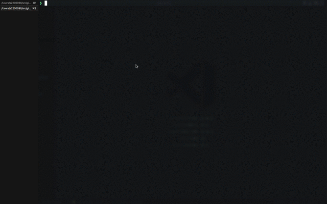

# 質問に答えるだけでファイルを生成するプログラムを作成した

## WD3A 岡崎 流依

---

## 目次

1. 作成に至った背景
2. 完成した物
3. 実際のコード
4. 解説

---

# 作成に至った背景

---

<!-- _header: 作成に至った背景 -->

### フロントエンド開発の時に特定のファイルを生成するのが面倒だった

---

# 完成した物

---



---

# 実際のコード

---

<!-- _header: 実際のコード -->

```
#!/bin/bash

echo "\n========コンポーネントを作成します========\n"

COMPONENTS_DIR='src/components'
if [ ! -d $COMPONENTS_DIR ];then
  mkdir $COMPONENTS_DIR
fi

echo '📝 コンポーネントの種類を入力してください'
PS3='(number): '
select GENRE in 'ui-elements' 'ui-parts'
do
  if [ ! -d $COMPONENTS_DIR/$GENRE ];then
    echo ✅ $GENRE ディレクトリを作成しました。
    mkdir $COMPONENTS_DIR/$GENRE
  fi
  break
done

echo '\n📝 コンポーネント名を入力してください(例: Button): '
read COMPONENTS_NAME
echo ''
if [ -d $COMPONENTS_DIR/$GENRE/$COMPONENTS_NAME ];then
  echo ❌ $COMPONENTS_NAME ディレクトリが存在します。最初からやり直してください。
  exit 1
fi
mkdir $COMPONENTS_DIR/$GENRE/$COMPONENTS_NAME

```

---

<!-- _header: 実際のコード -->

```
cat <<EOF > $COMPONENTS_DIR/$GENRE/$COMPONENTS_NAME/index.tsx
import { VFC } from 'react';
type Props = {};
const $COMPONENTS_NAME: VFC<Props> = ({  }) => {
  return (
    <></>
  )
};
export default $COMPONENTS_NAME;
EOF
echo ✅ $COMPONENTS_NAME/index.tsx を作成しました

cat <<EOF > $COMPONENTS_DIR/$GENRE/$COMPONENTS_NAME/$COMPONENTS_NAME.stories.tsx
import { ComponentStory, ComponentMeta } from '@storybook/react';
import $COMPONENTS_NAME from './index';
export default {
  title: '$GENRE/$COMPONENTS_NAME',
  component: $COMPONENTS_NAME,
} as ComponentMeta<typeof $COMPONENTS_NAME>;
export const Default1: ComponentStory<typeof $COMPONENTS_NAME> = () => (
  <$COMPONENTS_NAME></$COMPONENTS_NAME>
);
EOF
echo ✅ $COMPONENTS_NAME/$COMPONENTS_NAME.stories.tsx を作成しました
```

---

# 解説

---

Linux シェルでは先頭行に「#!/bin/bash」と書くべき
http://site.m-bsys.com/knowledge/linux-header

```
#!/bin/bash
```

src/components が存在しない場合、ディレクトリを生成する

```
echo "\n========コンポーネントを作成します========\n"

COMPONENTS_DIR='src/components'
if [ ! -d $COMPONENTS_DIR ];then
  mkdir $COMPONENTS_DIR
fi
```

---

コンポーネントの種類を番号で入力してもらいます。
対応するディレクトリが存在しない場合、ディレクトリを生成する
PS3 ← 入力の左側に出力する文字列

```
echo '📝 コンポーネントの種類を入力してください'
PS3='(number): '
select GENRE in 'ui-elements' 'ui-parts'
do
  if [ ! -d $COMPONENTS_DIR/$GENRE ];then
    echo ✅ $GENRE ディレクトリを作成しました。
    mkdir $COMPONENTS_DIR/$GENRE
  fi
  break
done
```

---

コンポーネントの名前を入力してもらいます。
ディレクトリが存在する場合は exit 1 を返却して処理を終了します。
※ exit 1 はエラーが起きて終了という意味

```
echo '\n📝 コンポーネント名を入力してください(例: Button): '
read COMPONENTS_NAME
echo ''
if [ -d $COMPONENTS_DIR/$GENRE/$COMPONENTS_NAME ];then
  echo ❌ $COMPONENTS_NAME ディレクトリが存在します。最初からやり直してください。
  exit 1
fi
mkdir $COMPONENTS_DIR/$GENRE/$COMPONENTS_NAME
```

---

# 完成〜！！🥳🥳🥳

あとは好みで npm script に記述しても良しです！

---

## 参考

Hack 31. PS3 - シェルスクリプト内の"select"に使用されるプロンプト
https://bobchin.hatenadiary.org/entry/20090503/1241340081
